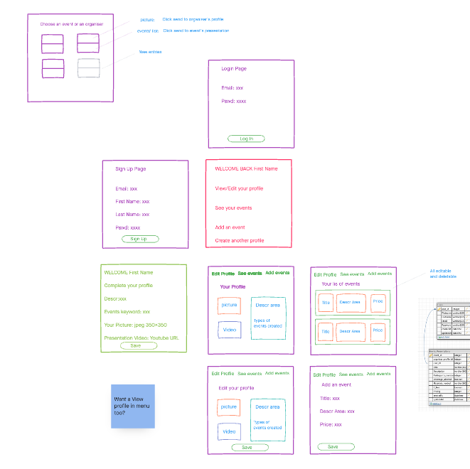

# organisers_space

This project is a SPA react.js application
It uses Node.js and Express
It uses Mysql in conjunction with Sequelize
It has a full authentication process from sign up to login
Basic styling was added via boostrap and CSS

The sprint board can be found here:
https://github.com/icodebyamanda/organisers_space/projects/1

### Server prep

- in project directory

npm install
This will install server-related dependencies such as express.

- cd into client and run
  npm install
  This will install client dependencies (React)

### Database prep

This project is using Sequelize for MySql

Access the MySQL interface in your terminal by running
mysql -u root -p

- Create a new database: create database projectname
- Add a .env file to the project folder of this repository containing the MySQL authentication information for MySQL user.

- For example:

DB_HOST=localhost
DB_USER=root
DB_NAME=DBNAME
DB_PASS=YOURPASSWORD

- set the steps of the migration with sequelize
- Run npm run migrate in your terminal in order to create the DB tables.

- To install sequelize use this command line in your terminal:
  npm install sequelize mysql2

### Other Dependencies to run in project folder

npm install jsonwebtoken bcrypt
npm install axios
npm install react-router
npm install bootstrap

### Dependency in the client folder:

cd into client and npm install react-router-dom

### Development

Run npm start in project directory to start the Express server on port 5000 In another terminal

do cd client and run npm start to start the client in development mode with hot reloading in port 3000

### Original Mock up to help the development

This mock up was not iterated along the way

[Click to view the mockup](https://amandar98755.invisionapp.com/freehand/organisers-space-S4agbYtQp)

### Database explanation

Please note, no seed data were added to this database, so please ensure to add your data before using this app.

We have 4 tables:

- 'Users' reused in the following part of the app: sign up, login, settings

- 'Organisers' so profile events organisers can set up to separate their different fields of interests and thus events (e.g. Photography events from Dance events)

- 'Events' which store all events created by a user under several profile aliases

- 'Keywords' which can be generated by an organiser's profile or a an event's creation. This choice was made rather for future opportunities to monitore apps usage and provide in the long run a better personalisation in terms of search (better than meetup hopefully)

- On the latter, I chose not to delete all keywords in spite of an event or a profile being deleted

Logic of the database and association reflected in the routes is:

- One User can own multiple Organiser's Profiles

- One Organiser's Profile can only belong to one User

- One Organiser's Profile can own multiple events

- One Organiser's Profile can own multiple Events keywords (describing events style' skillset)

- One Event can belong to only One Organiser's Profile

- One Event can own multiple Events keywords (describing upcoming event' style)

might be USELESS are:

- One User can own multiple Events
- One Event can belong to One User only

This application is unfinished and encounter some bugs.
